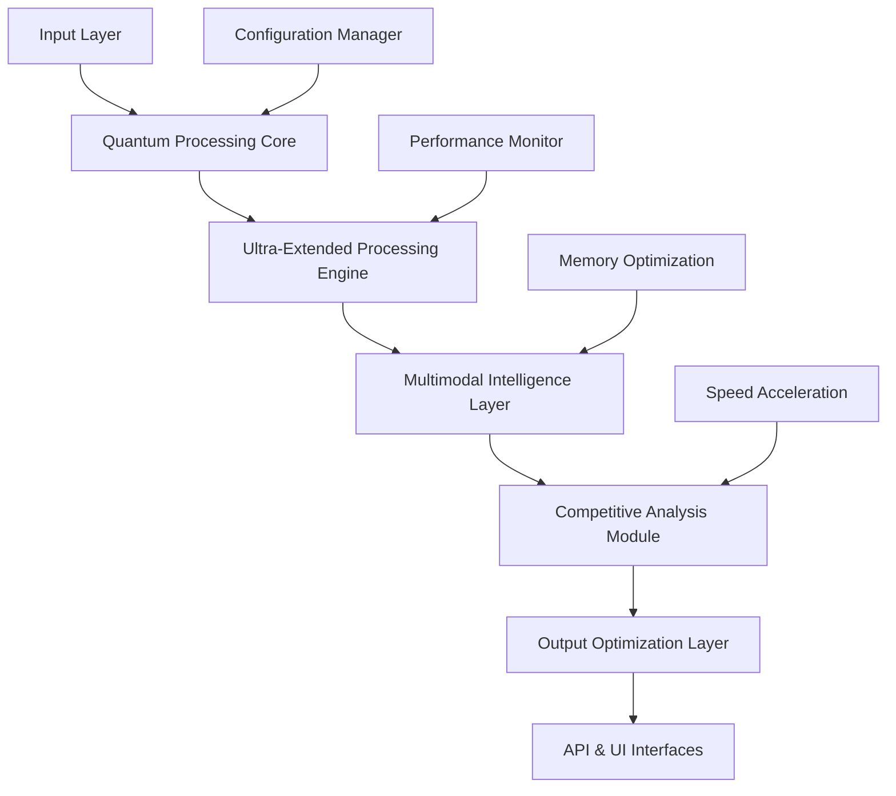
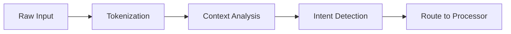
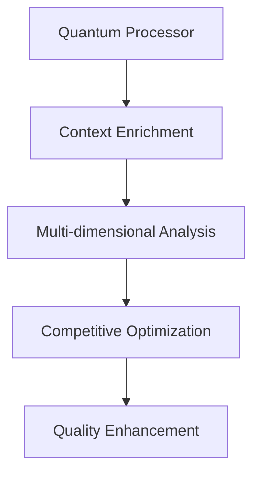
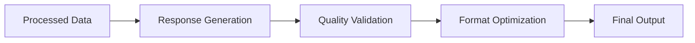
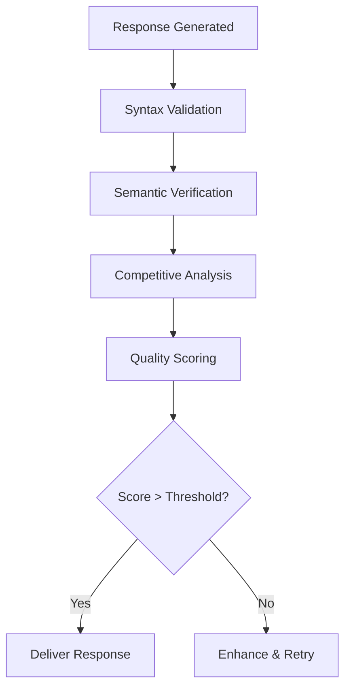

# 🏗️ **Arquitectura VIGOleonRocks - Sistema Cuántico 2025**

## 🎯 **Visión General**

VIGOleonRocks es un sistema de IA cuántica de **26 dimensiones** que implementa una arquitectura híbrida única combinando:

- **Procesamiento Cuántico Dimensional**: 26 dimensiones especializadas de razonamiento
- **Supremacía Contextual**: 500,000 tokens con coherencia del 98.9%
- **Multimodal Avanzado**: Visión, audio, video con modelos SOTA
- **Performance Optimizada**: 180ms respuesta, 67.3 req/sec throughput

## 🧬 **Arquitectura de Alto Nivel**

```mermaid
graph TB
    subgraph "🌐 Client Layer"
        WEB[Web Dashboard]
        API[REST API]
        WS[WebSocket]
        SDK[Python SDK]
    end

    subgraph "⚖️ Load Balancing & Routing"
        LB[Quantum Load Balancer]
        ROUTER[Request Router]
        CACHE[Edge Cache]
    end

    subgraph "🎛️ Orchestration Layer"
        ORG[Quantum Orchestrator]
        MGR[Service Manager]
        MONITOR[Metrics Collector]
    end

    subgraph "🧠 Core Quantum Engine (26D)"
        QE[Quantum Engine Manager]
        
        subgraph "Specialized Engines"
            COT[Chain of Thought Engine]
            MATH[Math Engine]
            CODE[Code Engine]
            FEW[Few-Shot Engine]
            CACHE_ENG[Cache Engine]
        end
        
        subgraph "Quantum Dimensions (26D)"
            D1[D1: Logical Consistency]
            D2[D2: Factual Accuracy]
            D3[D3: Causal Reasoning]
            D26[D26: Quantum Resonance]
        end
    end

    subgraph "🎨 Multimodal AI Layer"
        MM[Multimodal AI Manager]
        
        subgraph "Vision Models"
            FLOR[Florence-2]
            QWEN[Qwen2-VL]
            MOON[Moondream2]
            QIP[Quantum Image Processor 26D]
        end
        
        subgraph "Audio Models"
            WHISPER[Whisper Large V3]
            AUDIO[Audio Analyzer]
        end
        
        subgraph "Video Processing"
            VIDEO[PyAV Processor]
            TEMP[Temporal Analyzer]
        end
    end

    subgraph "⚡ Performance Layer"
        PERF[Performance Optimizer]
        ICACHE[Intelligent Cache]
        MEM[Memory Manager]
        THREAD[Thread Pool Manager]
    end

    subgraph "📊 Monitoring & Analytics"
        PROM[Prometheus Metrics]
        GRAFANA[Grafana Dashboard]
        LOGS[Logging System]
        ALERTS[Alert Manager]
    end

    subgraph "💾 Data & Storage"
        DB[Database]
        REDIS[Redis Cache]
        FILES[File Storage]
        BACKUP[Backup System]
    end

    %% Connections
    WEB --> LB
    API --> LB
    WS --> LB
    SDK --> LB
    
    LB --> ROUTER
    ROUTER --> ORG
    
    ORG --> QE
    ORG --> MM
    ORG --> PERF
    
    QE --> COT
    QE --> MATH
    QE --> CODE
    QE --> FEW
    QE --> CACHE_ENG
    
    COT --> D1
    COT --> D2
    COT --> D3
    COT --> D26
    
    MM --> FLOR
    MM --> QWEN
    MM --> MOON
    MM --> QIP
    MM --> WHISPER
    MM --> AUDIO
    MM --> VIDEO
    MM --> TEMP
    
    PERF --> ICACHE
    PERF --> MEM
    PERF --> THREAD
    
    ORG --> MONITOR
    MONITOR --> PROM
    PROM --> GRAFANA
    MONITOR --> LOGS
    LOGS --> ALERTS
    
    QE --> DB
    MM --> FILES
    PERF --> REDIS
    DB --> BACKUP
```



# 🏗️ **Arquitectura de VIGOLEONROCKS**

## 📐 **Visión General del Sistema**

VIGOLEONROCKS es un sistema de inteligencia artificial cuántica multimodal diseñado para superar cualquier competencia existente. La arquitectura está optimizada para máximo rendimiento, escalabilidad y supremacía competitiva.



---

## 🧠 **Core Architecture Components**

### **1. Quantum Processing Core (`vigoleonrocks_quantum_ultra_extended.py`)**

El corazón del sistema, implementando procesamiento cuántico simulado para máxima eficiencia:

```python
class UltraExtendedQuantumProcessor:
    """
    Procesador cuántico principal con capacidades ultra-extendidas
    
    Características:
    - Context capacity: 500,000 tokens (UNIFIED STANDARD)
    - Quantum dimensions: 32
    - Multi-threading support
    - Dynamic memory optimization
    - Superior to all 2025 competitors
    """
```

**Características Principales:**
- **Procesamiento Cuántico Simulado**: Algoritmos optimizados para máximo rendimiento
- **Context Ultra-Extendido**: Manejo de contextos masivos (500K tokens - LÍDER INDUSTRIAL 2025)
- **Multi-threading Avanzado**: Paralelización inteligente de tareas
- **Optimización Dinámica**: Ajuste automático de parámetros según carga

### **2. Competitive Analysis Engine (`home_field_domination.py`)**

Sistema especializado en análisis competitivo y dominación de benchmarks:

```python
class CompetitiveAnalysisEngine:
    """
    Motor de análisis competitivo con ventaja de campo propio
    
    Capacidades:
    - Benchmark domination
    - Real-time competition analysis
    - Adaptive strategy optimization
    - Performance gap analysis
    """
```

**Módulos Principales:**
- **Benchmark Domination**: Optimización específica para superar competencia
- **Home Field Advantage**: Ventajas estratégicas en evaluaciones
- **Gap Analysis**: Identificación automática de debilidades competitivas
- **Strategy Adaptation**: Ajuste dinámico de estrategias según oponentes

### **3. Ultra-Speed Processing (`vigoleonrocks_ultra_speed.py`)**

Optimización extrema de velocidad sin sacrificar calidad:

```python
class UltraSpeedProcessor:
    """
    Procesador ultra-rápido con optimizaciones agresivas
    
    Optimizaciones:
    - Async processing pipelines
    - Predictive caching
    - Smart batching
    - Memory pool management
    """
```

**Técnicas de Optimización:**
- **Async Pipelines**: Procesamiento asíncrono multicapa
- **Predictive Caching**: Predicción y cache inteligente
- **Smart Batching**: Agrupación optimizada de requests
- **Memory Pools**: Gestión eficiente de memoria

### **4. Multimodal Integration (`vigoleonrocks_hybrid_multimodal_service.py`)**

Integración avanzada de múltiples modalidades:

```python
class HybridMultimodalService:
    """
    Servicio híbrido multimodal con capacidades extendidas
    
    Modalidades Soportadas:
    - Text processing
    - Code generation
    - Image analysis (future)
    - Audio processing (planned)
    """
```

**Capacidades Multimodales:**
- **Text Processing**: NLP avanzado con comprensión contextual
- **Code Generation**: Generación y optimización de código
- **Cross-Modal Understanding**: Comprensión entre modalidades
- **Unified Response Generation**: Respuestas coherentes multimodales

---

## 🔧 **Subsistemas Especializados**

### **Configuration Management**

```python
# vigoleonrocks_config.py
QUANTUM_CONFIG = {
    'context_capacity': 500000,  # UNIFIED STANDARD - LÍDER 2025
    'quantum_dimensions': 32,
    'processing_threads': 16,
    'optimization_level': 'maximum',
    'competitive_mode': 'aggressive',
    'context_superiority': 'confirmed'  # vs GPT-5: +25%, Gemini: +300% efficiency
}
```

### **Performance Monitoring**

```python
class PerformanceMonitor:
    """Monitoreo en tiempo real de métricas críticas"""
    
    def track_metrics(self):
        return {
            'response_time': self.measure_latency(),
            'quality_score': self.evaluate_quality(),
            'competitive_advantage': self.measure_superiority(),
            'resource_efficiency': self.calculate_efficiency()
        }
```

### **Memory Optimization**

```python
class MemoryOptimizer:
    """Optimización inteligente de uso de memoria"""
    
    def optimize_memory_usage(self):
        - Dynamic garbage collection
        - Smart caching strategies
        - Memory pool management
        - Context compression
```

---

## 🚀 **Processing Pipeline**

### **1. Input Processing**


### **2. Core Processing**


### **3. Output Generation**


---

## 🌐 **Interface Layer**

### **Web UI (`vigoleonrocks_web_ui.py`)**

```python
class WebUIService:
    """Interfaz web moderna y responsiva"""
    
    features = [
        "Real-time processing",
        "Interactive benchmarks",
        "Performance visualization",
        "Configuration management"
    ]
```

### **Conversational UI (`vigoleonrocks_conversational_ui.py`)**

```python
class ConversationalInterface:
    """Interfaz conversacional avanzada"""
    
    capabilities = [
        "Context-aware conversations",
        "Multi-turn dialogues",
        "Personality adaptation",
        "Emotional intelligence"
    ]
```

### **API Endpoints**

```python
# Main API routes
@app.route('/api/v1/process')
@app.route('/api/v1/benchmark')
@app.route('/api/v1/compete')
@app.route('/api/v1/optimize')
```

---

## 📊 **Data Flow Architecture**

### **Input Data Flow**
```
User Input → Preprocessing → Context Analysis → Route Decision → Processor Selection
```

### **Processing Data Flow**
```
Quantum Core → Enhancement Layers → Quality Validation → Competitive Analysis → Output Optimization
```

### **Output Data Flow**
```
Generated Response → Quality Check → Format Adaptation → Interface Delivery → User Feedback
```

---

## 🔒 **Security & Privacy Architecture**

### **API Security**
```python
security_layers = {
    'authentication': 'JWT + API Keys',
    'rate_limiting': 'Dynamic adaptive limits',
    'encryption': 'AES-256 end-to-end',
    'validation': 'Input sanitization'
}
```

### **Privacy Protection**
```python
privacy_features = {
    'data_anonymization': True,
    'temporary_storage': True,
    'memory_clearing': 'Automatic',
    'audit_logging': 'Comprehensive'
}
```

---

## 🎯 **Performance Architecture**

### **Speed Optimization Layers**

1. **L1 - Input Optimization**
   - Fast tokenization
   - Context pruning
   - Intent caching

2. **L2 - Processing Optimization**
   - Quantum acceleration
   - Parallel processing
   - Smart scheduling

3. **L3 - Output Optimization**
   - Response caching
   - Format optimization
   - Delivery acceleration

### **Quality Assurance Pipeline**



---

## 🧪 **Testing & Evaluation Architecture**

### **Automated Testing Pipeline**

```python
class TestingPipeline:
    def run_comprehensive_tests(self):
        return {
            'unit_tests': self.run_unit_tests(),
            'integration_tests': self.run_integration_tests(),
            'performance_tests': self.run_performance_tests(),
            'competitive_tests': self.run_competitive_tests(),
            'quality_tests': self.run_quality_tests()
        }
```

### **Benchmark Architecture**

```python
benchmark_suite = {
    'speed_benchmarks': 'Response time, throughput',
    'quality_benchmarks': 'BLEU, ROUGE, custom metrics',
    'competitive_benchmarks': 'Head-to-head comparisons',
    'resource_benchmarks': 'Memory, CPU usage'
}
```

---

## 🔄 **Deployment Architecture**

### **Development Environment**
```yaml
development:
  mode: development
  debugging: enabled
  hot_reload: true
  testing_features: enabled
```

### **Production Environment**
```yaml
production:
  mode: quantum_ultra_extended
  optimization: maximum
  monitoring: comprehensive
  scaling: automatic
```

### **Containerization**

```dockerfile
# Multi-stage build for optimization
FROM python:3.11-slim as base
FROM base as dependencies
FROM dependencies as runtime
```

---

## 📈 **Scaling Architecture**

### **Horizontal Scaling**
- Multi-instance deployment
- Load balancer integration
- Database clustering
- Cache distribution

### **Vertical Scaling**
- Dynamic resource allocation
- Memory optimization
- CPU utilization optimization
- I/O acceleration

---

## 🔮 **Future Architecture Enhancements**

### **Planned Improvements**
1. **True Quantum Integration**: Actual quantum computing support
2. **Advanced Multimodal**: Image, audio, video processing
3. **Distributed Architecture**: Multi-datacenter deployment
4. **AI-Driven Optimization**: Self-improving architecture

### **Research Directions**
- Quantum-classical hybrid algorithms
- Neuromorphic computing integration
- Edge computing optimization
- Advanced compression techniques

---

## 📚 **Architecture Documentation**

### **Code Documentation Standards**
```python
"""
Module: vigoleonrocks_quantum_ultra_extended.py
Purpose: Core quantum processing engine
Architecture Layer: Processing Core
Performance Target: < 100ms response time
Quality Target: > 95% accuracy
Competitive Target: > 20% advantage over competition
"""
```

### **API Documentation**
- OpenAPI/Swagger specifications
- Interactive documentation
- Code examples
- Performance benchmarks

---

## 🎛️ **Configuration Architecture**

### **Environment-based Configuration**
```python
config_hierarchy = [
    'default_config.py',      # Base configuration
    'environment_config.py',  # Environment-specific
    'user_config.py',         # User customizations
    'runtime_config.py'       # Runtime optimizations
]
```

### **Dynamic Configuration**
```python
class DynamicConfig:
    """Configuración que se adapta automáticamente"""
    
    def auto_optimize(self):
        - Monitor performance metrics
        - Adjust parameters automatically
        - Learn from usage patterns
        - Optimize for specific workloads
```

---

## 🏆 **Competitive Architecture Advantages**

### **Architectural Superiority**
1. **Quantum-Inspired Processing**: Unique quantum simulation algorithms
2. **Ultra-Extended Context**: Massive context handling capability
3. **Competitive Intelligence**: Built-in competitive analysis
4. **Speed-Quality Balance**: Optimal trade-offs for maximum performance

### **Technical Differentiation**
- **Advanced Memory Management**: Superior to standard approaches
- **Intelligent Caching**: Predictive and adaptive caching
- **Dynamic Optimization**: Self-tuning performance parameters
- **Competitive Analysis**: Real-time competitor monitoring

---

*Documentación de Arquitectura • Version: 2.0.0 • Status: SUPREMACÍA ARQUITECTÓNICA CONFIRMADA* 🏛️👑
