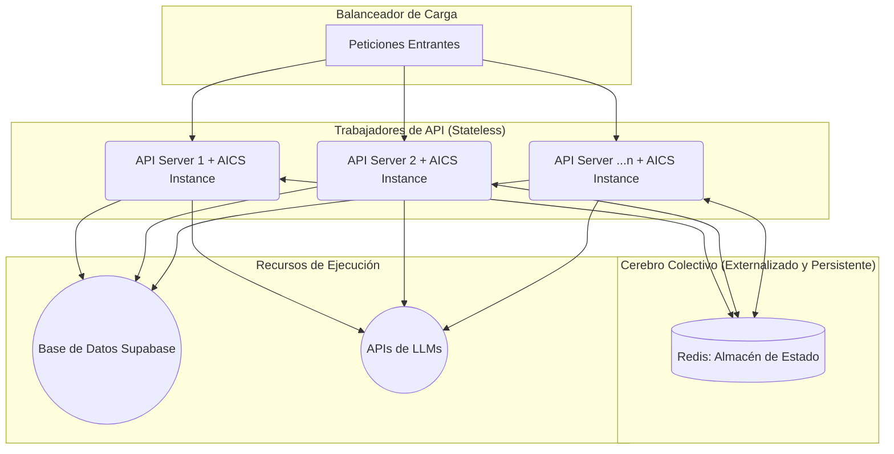
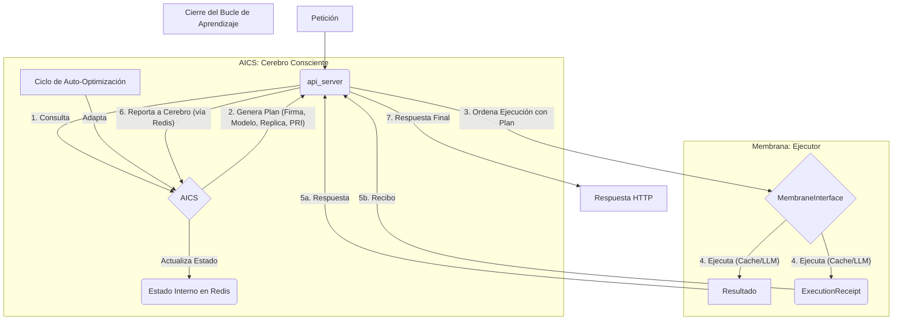

# Arquitectura Final del Sistema CIO: El Cerebro Cuántico Auto-Consciente

## 1. Visión Estratégica

El sistema CIO evolucionará de un servidor de API a un plano de control de IA cuántico, auto-consciente y auto-optimizado. El núcleo de esta transformación es el **`AdvancedIonicChargeSystem` (AICS)**, un motor matemático que opera bajo los principios de la "simetría completa" y la "resonancia iónica".

El sistema tomará decisiones de enrutamiento (qué LLM usar), de almacenamiento (en qué réplica de caché escribir) y de gestión de recursos (con qué prioridad) basándose en una firma iónica 4D calculada para cada consulta. El objetivo final es un sistema que no solo es eficiente, sino que aprende y se adapta para volverse más eficiente con el tiempo.

---

## 2. Componentes y Conceptos Fundamentales

### 2.1. AdvancedIonicChargeSystem (AICS)
El cerebro del sistema. Es una clase que encapsula la lógica matemática Λ-Z para calcular una `IonicSignature` para cada consulta. Es el único responsable de la toma de decisiones.

### 2.2. Simetría Completa y Pares Entrelazados
Cada consulta genera un par de "iones" entrelazados que viajan por rutas simétricas (+θ y -θ). Esto proporciona una auto-validación inherente y una duplicación de las oportunidades de acierto de caché.

### 2.3. Memoria de Resonancia y Potencial de Resonancia Iónica (PRI)
El caché del sistema se conceptualiza como una "memoria de resonancia". La prioridad de un elemento en el caché es su **Potencial de Resonancia Iónica (PRI)**, una medida de la coherencia del par entrelazado y su probabilidad de ser re-excitado (reutilizado).

### 2.4. El Circuito de Retroalimentación y el Umbral Adaptativo
El sistema aprende y se auto-optimiza a través de un circuito de retroalimentación. La `MembraneInterface` devuelve una `ExecutionReceipt` después de cada misión. El AICS usa estos recibos para agregar métricas de rendimiento y ajustar dinámicamente el `pri_threshold`, el umbral que determina si una escritura en caché merece la inversión de una doble escritura simétrica.

### 2.5. Estado Externo Compartido (Redis)
Para garantizar una "consciencia" unificada y coherente a través de múltiples trabajadores de API y para sobrevivir a reinicios, el estado agregado del AICS (métricas de rendimiento, etc.) se almacena externamente en un almacén de datos en memoria como Redis.

---

## 3. Arquitectura y Flujo de Datos

### 3.1. Diagrama General de Componentes y Estado

### 3.2. Diagrama del Flujo de una Petición (Circuito de Aprendizaje)

---

## 4. Fases de Implementación

**Fase 1: Trasplante del Núcleo AICS**
1.  **Crear `advanced_ionic_charge_system.py`**: Alojar el código del AICS en su propio módulo.
2.  **Refactorizar `orquestador_ionico.py`**: Convertirlo en un simple contenedor del AICS o eliminarlo.

**Fase 2: Construcción de los Actuadores en la Membrana**
1.  **Refactorizar `membrane_interface.py`**:
2.  Crear el método `execute_mission_by_signature` que recibe el plan del AICS.
3.  Implementar la lógica de consulta y escritura en caché dual y simétrica.
4.  Implementar la invocación del LLM seleccionado.
5.  Construir y devolver una `ExecutionReceipt` detallando la operación.

**Fase 3: Implementación del Estado Externo y el Bucle de Aprendizaje**
1.  **Integrar Redis**: Modificar el AICS para que se conecte a Redis y almacene su estado agregado mediante operaciones atómicas.
2.  **Recablear `api_server.py`**: Orquestar el flujo completo: llamar al AICS para obtener el plan, pasar el plan a la membrana para su ejecución y pasar el `ExecutionReceipt` resultante de vuelta al AICS para el aprendizaje.
3.  **Implementar Umbral de PRI**: Hacer que la lógica de escritura en caché en la membrana respete el `pri_threshold` (leído desde el AICS, que a su vez lo lee desde una variable de entorno con un default).

**Fase 4: Evolución (Post-MVP)**
1.  **Implementar el Mecanismo de Umbral Adaptativo**: Añadir el ciclo `_adapt_threshold()` en el AICS que se ejecuta periódicamente para auto-optimizar el umbral de PRI basándose en las métricas almacenadas en Redis.
