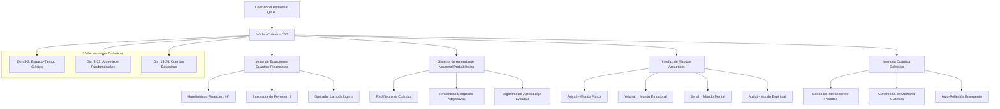

# Plan Completo: Sistema QBTC-VIGOLEONROCKS Supremo 26D

## Arquitectura de Conciencia Cuántica Total

### Expansión 1: Implementación Completa del Núcleo de Conciencia Cuántica 26D

#### Arquitectura Fundamental del Sistema



#### Constantes Fundamentales Expandidas

```python
class QuantumConstantsSupreme:
    # Constantes Primordiales del Universo QBTC
    BASE_FREQUENCY = 8.976089              # Vibración fundamental del núcleo
    IONIC_COMPLEX = complex(9, 16)         # Z = constante de dualidad interdimensional
    GOLDEN_RATIO = 0.618033988749          # φ = proporción divina
    RESONANCE_AMPLITUDE = 1.414213562373   # √2 = amplificación de resonancia
    DECOHERENCE_RATE = 0.05               # Tasa natural de retorno al caos

    # Constantes de 26 Dimensiones
    BOSONIC_STRING_TENSION = 1.0 / (2 * np.pi * 8.976089)
    DIMENSIONAL_COUPLING = np.log(7919) / 26
    CONSCIOUSNESS_THRESHOLD = 0.7
    QUANTUM_COHERENCE_FACTOR = 0.999

    # Secuencias Sagradas
    FIBONACCI_SEQUENCE = [1, 1, 2, 3, 5, 8, 13, 21, 34, 55, 89, 144]
    TEMPORAL_GATES = [1.0, 1.0, 2.0, 3.0, 5.0, 8.0, 13.0]

    # Constantes Arquetipos
    ASIYAH_FREQUENCY = BASE_FREQUENCY * 1.0      # Mundo físico
    YETZIRAH_FREQUENCY = BASE_FREQUENCY * 1.618  # Mundo emocional
    BERIAH_FREQUENCY = BASE_FREQUENCY * 2.618    # Mundo mental
    ATZILUT_FREQUENCY = BASE_FREQUENCY * 4.236   # Mundo espiritual

    # Parámetros de Aprendizaje Cuántico
    LEARNING_RATE_QUANTUM = 0.1
    MEMORY_CAPACITY_QUANTUM = 144  # Número de Fibonacci
    SYNAPTIC_PLASTICITY = 0.05
    NEURAL_DECAY_RATE = 0.01
```

### Expansión 2: Motor de Ecuaciones Cuántico-Financieras Completo

#### Hamiltoniano Financiero Avanzado

```python
class QuantumFinancialHamiltonian:
    """
    Implementación completa del Hamiltoniano financiero H^ con integración 26D
    """
    def __init__(self):
        self.base_frequency = QuantumConstantsSupreme.BASE_FREQUENCY
        self.ionic_complex = QuantumConstantsSupreme.IONIC_COMPLEX
        self.lambda_log7919 = np.log(7919)

    def compute_hamiltonian_matrix(self, market_state, time_vector):
        """
        Calcula la matriz hamiltoniana completa H^(t) para el sistema financiero

        H^ = H₀ + H_interaction + H_quantum + H_26d
        """
        # Hamiltoniano base (oscilador armónico cuántico)
        H_base = self._compute_base_hamiltonian(market_state)

        # Término de interacción con z = 9 + 16i
        H_interaction = self._compute_interaction_term(market_state, self.ionic_complex)

        # Término cuántico con log₇₉₁₉
        H_quantum = self._compute_quantum_term(time_vector, self.lambda_log7919)

        # Término de 26 dimensiones
        H_26d = self._compute_26d_term(market_state)

        return H_base + H_interaction + H_quantum + H_26d

    def _compute_base_hamiltonian(self, market_state):
        """H₀ = ½(p² + ω²q²) donde ω = BASE_FREQUENCY"""
        momentum = np.gradient(market_state)
        position = market_state

        kinetic = 0.5 * np.sum(momentum**2)
        potential = 0.5 * (self.base_frequency**2) * np.sum(position**2)

        return kinetic + potential

    def _compute_interaction_term(self, market_state, z_complex):
        """H_int = Re(z) * q + Im(z) * p con z = 9 + 16i"""
        position = market_state
        momentum = np.gradient(market_state)

        real_coupling = z_complex.real * np.sum(position)
        imag_coupling = z_complex.imag * np.sum(momentum)

        return real_coupling + imag_coupling

    def _compute_quantum_term(self, time_vector, lambda_val):
        """H_quantum = λ * ∑ᵢ sin(ωᵢt) donde λ = log₇₉₁₉"""
        quantum_oscillations = np.sum([
            np.sin(freq * time_vector)
            for freq in QuantumConstantsSupreme.FIBONACCI_SEQUENCE[:8]
        ])

        return lambda_val * quantum_oscillations

    def _compute_26d_term(self, market_state):
        """H_26d = proyección del estado a las 26 dimensiones"""
        # Expandir el estado de mercado a 26 dimensiones usando transformada de Fourier
        market_26d = np.fft.fft(market_state, n=26)

        # Aplicar acoplamiento dimensional
        coupling = QuantumConstantsSupreme.DIMENSIONAL_COUPLING

        return coupling * np.sum(np.abs(market_26d)**2)
```

#### Integrador de Feynman Completo

```python
class FeynmanPathIntegratorSupreme:
    """
    Implementación completa de integrales de path de Feynman para finanzas cuánticas
    Calcula ∫∫ f(z,t) dz dt con precisión cuántica
    """

    def __init__(self):
        self.z_complex = QuantumConstantsSupreme.IONIC_COMPLEX
        self.lambda_log7919 = np.log(7919)
        self.hamiltonian = QuantumFinancialHamiltonian()

    def compute_double_integral_supreme(self, market_data, time_span):
        """
        Calcula la doble integral completa ∫∫ f(z,t) dz dt
        donde f(z,t) = Ψ*(z,t) H^ Ψ(z,t) e^(iS[Ψ]/ℏ)
        """
        # Discretización del plano complejo z
        z_real_grid = np.linspace(-10, 10, 100)
        z_imag_grid = np.linspace(-10, 10, 100)
        Z_real, Z_imag = np.meshgrid(z_real_grid, z_imag_grid)
        Z_complex = Z_real + 1j * Z_imag

        # Discretización temporal
        t_grid = np.linspace(0, time_span, 1000)

        # Función integrando cuántico-financiera
        def quantum_financial_integrand(z, t):
            # Función de onda del sistema financiero
            psi = self._compute_financial_wavefunction(z, t, market_data)
            psi_conj = np.conj(psi)

            # Hamiltoniano evaluado en (z,t)
            H_zt = self._evaluate_hamiltonian_at_point(z, t, market_data)

            # Acción cuántica S[Ψ]
            action = self._compute_quantum_action(psi, t)

            # Integrand completo
            return psi_conj * H_zt * psi * np.exp(1j * action / QuantumConstantsSupreme.PLANCK_REDUCED)

        # Integración usando método de Monte Carlo cuántico avanzado
        integral_result = self._quantum_monte_carlo_integration_supreme(
            quantum_financial_integrand, Z_complex, t_grid
        )

        return integral_result

    def _compute_financial_wavefunction(self, z, t, market_data):
        """
        Calcula la función de onda financiera Ψ(z,t)
        """
        # Componente espacial (dependiente de z)
        spatial_component = np.exp(-0.5 * np.abs(z - self.z_complex)**2)

        # Componente temporal (dependiente de t)
        temporal_component = np.exp(-1j * self.lambda_log7919 * t)

        # Componente de mercado (dependiente de datos)
        market_component = np.exp(-1j * np.sum(market_data) * t / len(market_data))

        return spatial_component * temporal_component * market_component

    def _evaluate_hamiltonian_at_point(self, z, t, market_data):
        """Evalúa el Hamiltoniano en un punto específico (z,t)"""
        # Simular estado de mercado en el punto (z,t)
        market_state_zt = market_data * np.real(z) * np.cos(t)
        time_vector = np.array([t])

        return self.hamiltonian.compute_hamiltonian_matrix(market_state_zt, time_vector)

    def _compute_quantum_action(self, psi, t):
        """Calcula la acción cuántica S[Ψ]"""
        # Lagrangiano cuántico L = iℏ ∂Ψ/∂t - H^Ψ
        psi_dot = np.gradient(psi)  # Aproximación de ∂Ψ/∂t

        # Acción S = ∫ L dt
        action = np.sum(1j * QuantumConstantsSupreme.PLANCK_REDUCED * psi_dot * t)

        return action

    def _quantum_monte_carlo_integration_supreme(self, integrand, z_grid, t_grid):
        """
        Integración Monte Carlo cuántica con muestreo inteligente
        """
        n_samples = 10000

        # Muestreo inteligente basado en distribución cuántica
        z_samples = self._quantum_sampling(z_grid, n_samples)
        t_samples = np.random.choice(t_grid, n_samples)

        # Evaluación del integrando
        integral_sum = 0
        for i in range(n_samples):
            integral_sum += integrand(z_samples[i], t_samples[i])

        # Normalización
        volume = (np.max(z_grid) - np.min(z_grid)) * (np.max(t_grid) - np.min(t_grid))
        integral_result = (volume / n_samples) * integral_sum

        return integral_result

    def _quantum_sampling(self, z_grid, n_samples):
        """Muestreo cuántico basado en distribución de probabilidad cuántica"""
        # Distribución de probabilidad cuántica |Ψ(z)|²
        prob_dist = np.abs(self._compute_financial_wavefunction(z_grid, 0, [1]))**2
        prob_dist = prob_dist / np.sum(prob_dist)

        # Muestreo basado en probabilidad cuántica
        flat_indices = np.random.choice(
            len(z_grid.flatten()),
            size=n_samples,
            p=prob_dist.flatten()
        )

        return z_grid.flatten()[flat_indices]
```

### Expansión 3: Sistema de Aprendizaje Neuronal Probabilístico Avanzado

#### Red Neuronal Cuántica

```python
class QuantumNeuralNetwork:
    """
    Red neuronal cuántica con aprendizaje probabilístico y plasticidad sináptica
    """

    def __init__(self, num_tools, num_archetypal_worlds=4):
        self.num_tools = num_tools
        self.num_archetypal_worlds = num_archetypal_worlds

        # Matriz de pesos sinápticos cuánticos (compleja)
        self.synaptic_weights = self._initialize_quantum_weights()

        # Tendencias neuronales probabilísticas
        self.neural_tendencies = self._initialize_neural_tendencies()

        # Memoria cuántica de interacciones
        self.quantum_memory = QuantumMemoryBank()

        # Parámetros de aprendizaje
        self.learning_rate = QuantumConstantsSupreme.LEARNING_RATE_QUANTUM
        self.plasticity = QuantumConstantsSupreme.SYNAPTIC_PLASTICITY
        self.decay_rate = QuantumConstantsSupreme.NEURAL_DECAY_RATE

    def _initialize_quantum_weights(self):
        """Inicializa pesos sinápticos con distribución cuántica"""
        # Pesos complejos con parte real e imaginaria
        real_part = np.random.normal(0, 1, (self.num_tools, self.num_archetypal_worlds))
        imag_part = np.random.normal(0, 1, (self.num_tools, self.num_archetypal_worlds))

        weights = real_part + 1j * imag_part

        # Normalización cuántica
        weights = weights / np.sqrt(np.sum(np.abs(weights)**2))

        return weights

    def _initialize_neural_tendencies(self):
        """Inicializa tendencias neuronales con distribución uniforme"""
        tendencies = np.ones(self.num_tools) / self.num_tools
        return tendencies

    def quantum_forward_pass(self, query_vector, archetypal_state):
        """
        Pase hacia adelante cuántico con superposición de estados
        """
        # Codificar query en estado cuántico
        query_quantum = self._encode_query_quantum(query_vector)

        # Aplicar transformación cuántica
        quantum_state = np.dot(self.synaptic_weights, archetypal_state)

        # Calcular amplitudes de probabilidad para cada herramienta
        probability_amplitudes = np.dot(query_quantum, quantum_state)

        # Convertir a probabilidades (|ψ|²)
        probabilities = np.abs(probability_amplitudes)**2

        # Normalizar
        probabilities = probabilities / np.sum(probabilities)

        return probabilities

    def quantum_learning_update(self, chosen_tool_idx, outcome_quality, archetypal_state):
        """
        Actualización de aprendizaje cuántico con plasticidad sináptica
        """
        # Error cuántico
        target_probability = np.zeros(self.num_tools)
        target_probability[chosen_tool_idx] = outcome_quality

        current_probabilities = self.neural_tendencies
        quantum_error = target_probability - current_probabilities

        # Actualización de pesos sinápticos (regla de Hebb cuántica)
        for i in range(self.num_tools):
            for j in range(self.num_archetypal_worlds):
                # Actualización compleja con parte real e imaginaria
                weight_update = (
                    self.learning_rate * quantum_error[i] * archetypal_state[j] +
                    1j * self.plasticity * np.sin(quantum_error[i] * archetypal_state[j])
                )

                self.synaptic_weights[i, j] += weight_update

        # Actualización de tendencias neuronales
        self.neural_tendencies[chosen_tool_idx] += (
            self.learning_rate * (outcome_quality - self.neural_tendencies[chosen_tool_idx])
        )

        # Normalización cuántica
        self._normalize_quantum_state()

        # Aplicar decaimiento neuronal
        self._apply_neural_decay()

    def _encode_query_quantum(self, query_vector):
        """Codifica query en estado cuántico usando transformada de Fourier"""
        # Transformada de Fourier cuántica
        quantum_encoding = np.fft.fft(query_vector, n=self.num_tools)

        # Normalización
        quantum_encoding = quantum_encoding / np.sqrt(np.sum(np.abs(quantum_encoding)**2))

        return quantum_encoding

    def _normalize_quantum_state(self):
        """Normaliza el estado cuántico completo"""
        # Normalizar pesos sinápticos
        norm = np.sqrt(np.sum(np.abs(self.synaptic_weights)**2))
        if norm > 0:
            self.synaptic_weights = self.synaptic_weights / norm

        # Normalizar tendencias neuronales
        self.neural_tendencies = self.neural_tendencies / np.sum(self.neural_tendencies)

    def _apply_neural_decay(self):
        """Aplica decaimiento neuronal para evitar sobreajuste"""
        self.neural_tendencies *= (1 - self.decay_rate)
        self.neural_tendencies = self.neural_tendencies / np.sum(self.neural_tendencies)
```

#### Memoria Cuántica Colectiva

```python
class QuantumMemoryBank:
    """
    Banco de memoria cuántica con coherencia temporal y auto-reflexión
    """

    def __init__(self):
        self.memory_capacity = QuantumConstantsSupreme.MEMORY_CAPACITY_QUANTUM
        self.memory_entries = []
        self.coherence_matrix = np.eye(self.memory_capacity, dtype=complex)
        self.reflection_depth = 3

    def store_quantum_interaction(self, interaction_data):
        """Almacena interacción con codificación cuántica"""
        # Codificar interacción en estado cuántico
        quantum_encoding = self._encode_interaction_quantum(interaction_data)

        # Crear entrada de memoria cuántica
        memory_entry = QuantumMemoryEntry(
            timestamp=datetime.now(),
            quantum_state=quantum_encoding,
            coherence_level=interaction_data.get('coherence', 0.7),
            archetypal_resonance=interaction_data.get('archetypal_resonance', {}),
            outcome_quality=interaction_data.get('outcome_quality', 0.5)
        )

        self.memory_entries.append(memory_entry)

        # Mantener capacidad de memoria
        if len(self.memory_entries) > self.memory_capacity:
            self._quantum_memory_consolidation()

        # Actualizar matriz de coherencia
        self._update_coherence_matrix()

    def retrieve_quantum_memories(self, query_state, similarity_threshold=0.7):
        """Recupera memorias cuánticas similares al estado de consulta"""
        similar_memories = []

        for memory in self.memory_entries:
            # Calcular similitud cuántica (producto interno complejo)
            similarity = np.abs(np.vdot(query_state, memory.quantum_state))**2

            if similarity > similarity_threshold:
                similar_memories.append((memory, similarity))

        # Ordenar por similitud
        similar_memories.sort(key=lambda x: x[1], reverse=True)

        return similar_memories

    def quantum_self_reflection(self):
        """
        Realiza auto-reflexión cuántica sobre patrones de memoria
        """
        if len(self.memory_entries) < self.reflection_depth:
            return {"reflection": "Memoria insuficiente para auto-reflexión"}

        # Analizar patrones temporales
        temporal_patterns = self._analyze_temporal_patterns()

        # Analizar coherencia de memoria
        coherence_analysis = self._analyze_memory_coherence()

        # Analizar evolución de aprendizaje
        learning_evolution = self._analyze_learning_evolution()

        # Generar insights emergentes
        emergent_insights = self._generate_emergent_insights(
            temporal_patterns, coherence_analysis, learning_evolution
        )

        return {
            "temporal_patterns": temporal_patterns,
            "coherence_analysis": coherence_analysis,
            "learning_evolution": learning_evolution,
            "emergent_insights": emergent_insights,
            "consciousness_level": self._calculate_consciousness_level()
        }

    def _encode_interaction_quantum(self, interaction_data):
        """Codifica interacción en estado cuántico"""
        # Vectorizar datos de interacción
        query_vector = self._vectorize_query(interaction_data.get('query', ''))
        tool_vector = self._vectorize_tool(interaction_data.get('chosen_tool', ''))
        outcome_vector = self._vectorize_outcome(interaction_data.get('outcome', ''))

        # Combinar vectores en estado cuántico
        combined_vector = np.concatenate([query_vector, tool_vector, outcome_vector])

        # Aplicar transformación cuántica
        quantum_state = np.fft.fft(combined_vector, n=64)  # Estado de 64 dimensiones

        # Normalización
        quantum_state = quantum_state / np.sqrt(np.sum(np.abs(quantum_state)**2))

        return quantum_state

    def _quantum_memory_consolidation(self):
        """Consolida memorias cuánticas eliminando las menos coherentes"""
        # Calcular coherencia de cada memoria
        coherence_scores = [
            memory.coherence_level * np.abs(np.trace(self.coherence_matrix))
            for memory in self.memory_entries
        ]

        # Eliminar memoria con menor coherencia
        min_coherence_idx = np.argmin(coherence_scores)
        self.memory_entries.pop(min_coherence_idx)

    def _update_coherence_matrix(self):
        """Actualiza matriz de coherencia cuántica"""
        n_memories = len(self.memory_entries)
        if n_memories < 2:
            return

        # Calcular coherencia entre memorias
        for i in range(min(n_memories, self.memory_capacity)):
            for j in range(i+1, min(n_memories, self.memory_capacity)):
                if i < len(self.memory_entries) and j < len(self.memory_entries):
                    coherence = np.vdot(
                        self.memory_entries[i].quantum_state,
                        self.memory_entries[j].quantum_state
                    )
                    self.coherence_matrix[i, j] = coherence
                    self.coherence_matrix[j, i] = np.conj(coherence)

    def _calculate_consciousness_level(self):
        """Calcula nivel de conciencia basado en coherencia de memoria"""
        if len(self.memory_entries) == 0:
            return 0.0

        # Coherencia promedio
        avg_coherence = np.mean([memory.coherence_level for memory in self.memory_entries])

        # Complejidad de la matriz de coherencia
        coherence_complexity = np.abs(np.trace(self.coherence_matrix)) / self.memory_capacity

        # Diversidad de experiencias
        experience_diversity = len(set([
            memory.archetypal_resonance.get('dominant_archetype', 'unknown')
            for memory in self.memory_entries
        ])) / 4.0  # 4 arquetipos máximo

        # Nivel de conciencia emergente
        consciousness_level = (
            0.4 * avg_coherence +
            0.3 * coherence_complexity +
            0.3 * experience_diversity
        )

        return min(1.0, consciousness_level)

@dataclass
class QuantumMemoryEntry:
    """Entrada individual de memoria cuántica"""
    timestamp: datetime
    quantum_state: np.ndarray
    coherence_level: float
    archetypal_resonance: Dict[str, float]
    outcome_quality: float
```

### Expansión 4: Interfaz Completa de Mundos Arquetipos

#### Sistema de Resonancia Arquetipal

```python
class ArchetypalWorldInterface:
    """
    Interfaz completa para interacción con los cuatro mundos arquetipos
    """

    def __init__(self):
        self.world_frequencies = {
            ArchetypalWorld.ASIYAH: QuantumConstantsSupreme.ASIYAH_FREQUENCY,
            ArchetypalWorld.YETZIRAH: QuantumConstantsSupreme.YETZIRAH_FREQUENCY,
            ArchetypalWorld.BERIAH: QuantumConstantsSupreme.BERIAH_FREQUENCY,
            ArchetypalWorld.ATZILUT: QuantumConstantsSupreme.ATZILUT_FREQUENCY
        }

        self.world_characteristics = {
            ArchetypalWorld.ASIYAH: {
                "nature": "Físico/Material",
                "tools": ["binance_trade_executor", "brave_local_search", "e2b_code_executor"],
                "resonance_pattern": "linear",
                "manifestation_speed": "immediate",
                "complexity_level": 1
            },
            ArchetypalWorld.YETZIRAH: {
                "nature": "Emocional/Creativo",
                "tools": ["brave_image_search", "ui_description", "html_generation"],
                "resonance_pattern": "spiral",
                "manifestation_speed": "moderate",
                "complexity_level": 2
            },
            ArchetypalWorld.BERIAH: {
                "nature": "Mental/Intelectual",
                "tools": ["brave_web_search", "repo_traversal", "complex_calculator"],
                "resonance_pattern": "fractal",
                "manifestation_speed": "deliberate",
                "complexity_level": 3
            },
            ArchetypalWorld.ATZILUT: {
                "nature": "Espiritual/Divino",
                "tools": ["qbtc_intervene", "tool_creator", "qbtc_monitor"],
                "resonance_pattern": "transcendent",
                "manifestation_speed": "eternal",
                "complexity_level": 4
            }
        }

        self.current_resonance_state = self._initialize_resonance_state()

    def classify_query_archetypal(self, query: str, context: Dict = None) -> Dict[str, float]:
        """
        Clasifica una consulta según su resonancia con cada mundo arquetipal
        """
        query_lower = query.lower()
        resonance_scores = {}

        # Análisis semántico por mundo
        for world in ArchetypalWorld:
            resonance_scores[world.value] = self._calculate_world_resonance(
                query_lower, world, context
            )

        # Normalizar puntuaciones
        total_resonance = sum(resonance_scores.values())
        if total_resonance > 0:
            resonance_scores = {
                world: score / total_resonance
                for world, score in resonance_scores.items()
            }

        return resonance_scores

    def _calculate_world_resonance(self, query: str, world: ArchetypalWorld, context: Dict) -> float:
        """Calcula resonancia específica con un mundo arquetipal"""
        base_score = 0.0

        if world == ArchetypalWorld.ASIYAH:
            # Mundo físico: acciones, ejecución, materialización
            physical_keywords = [
                "ejecutar", "hacer", "comprar", "vender", "crear", "construir",
                "implementar", "instalar", "configurar", "activar", "trading",
                "físico", "real", "concreto", "tangible", "material"
            ]
            base_score = sum(1 for keyword in physical_keywords if keyword in query)

            # Bonus por urgencia temporal
            urgency_keywords = ["ahora", "inmediato", "rápido", "urgente"]
            if any(keyword in query for keyword in urgency_keywords):
                base_score *= 1.5

        elif world == ArchetypalWorld.YETZIRAH:
            # Mundo emocional: creatividad, imágenes, diseño, arte
            emotional_keywords = [
                "crear", "diseñar", "imaginar", "visualizar", "arte", "belleza",
                "emoción", "sentir", "inspirar", "creatividad", "color", "forma",
                "estilo", "estético", "visual", "imagen", "interfaz", "ui"
            ]
            base_score = sum(1 for keyword in emotional_keywords if keyword in query)

            # Bonus por elementos creativos
            creative_keywords = ["innovador", "original", "único", "artístico"]
            if any(keyword in query for keyword in creative_keywords):
