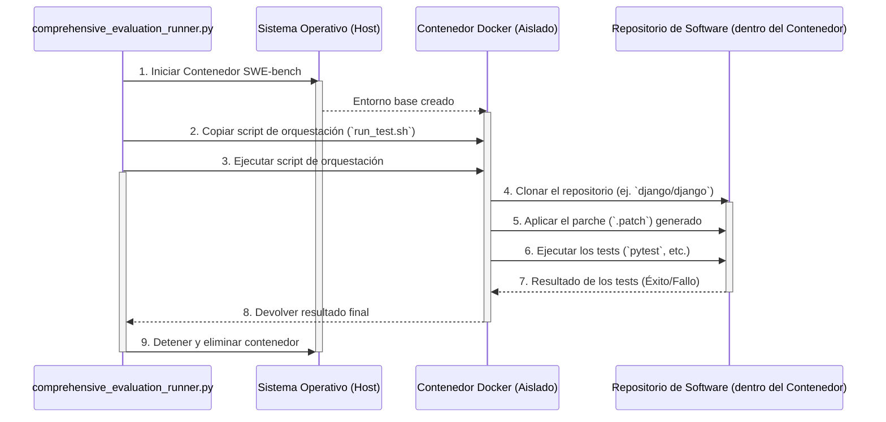

# Plan de Implementación del Benchmark SWE-bench

## 1. Resumen Ejecutivo

Este documento detalla el plan técnico para integrar el benchmark **SWE-bench** en el framework de evaluación personalizado existente, `comprehensive_evaluation_runner.py`. El objetivo es permitir una evaluación rigurosa y reproducible del modelo **ExponentialLambdaOptimizationCIO** en tareas de resolución de problemas de ingeniería de software del mundo real, y compararlo de manera justa con los principales modelos de la industria.

## 2. Análisis del Framework de Evaluación Actual

Nuestra investigación ha revelado que el proyecto utiliza un script de evaluación propio, [`comprehensive_evaluation_runner.py`](localGPT-quantum-supreme/comprehensive_evaluation_runner.py:1), en lugar de un framework estándar como `oumi` o `deepeval`.

Las características clave de este runner son:
*   **Evaluación en Vivo para el CIO:** El modelo `ExponentialLambdaOptimizationCIO` es evaluado en tiempo real a través de llamadas a una API (`http://127.0.0.1:5001/api/quantum_query`).
*   **Scores Simulados para Competidores:** Los modelos de la competencia (GPT-4, Claude, etc.) no son ejecutados. En su lugar, el script utiliza una tabla de scores fijos (`placeholder_scores`) para generar el reporte comparativo.
*   **Tareas Conceptuales:** Las "tareas" (`MMLU`, `MATH`, `CODING`, `CREATIVITY`) son categorías de alto nivel, y la evaluación del CIO para cada una se basa en el éxito de un único prompt representativo.

## 3. Plan de Implementación Detallado

Nuestra estrategia se basa en **extender el runner existente** para incorporar SWE-bench como una nueva tarea, manteniendo la coherencia con la metodología actual.

### Fase 1: Extender `EvaluationRunner`

Modificaremos el script `comprehensive_evaluation_runner.py` para que reconozca a SWE-bench como una nueva tarea válida.

```python
# En el método _initialize_benchmarks() de comprehensive_evaluation_runner.py

def _initialize_benchmarks(self) -> List[Dict]:
    """Inicializa las pruebas de evaluación"""
    return [
        # ... benchmarks existentes (MMLU, MATH, etc.)
        {
            "name": "SWE-bench",
            "description": "Resolución de problemas de ingeniería de software del mundo real.",
            "metrics": ["resolve_rate"] # La métrica principal y estándar de SWE-bench
        }
    ]
```

### Fase 2: Implementar la Lógica de Evaluación de SWE-bench

Esta es la parte central de la implementación.

#### 2.1 Lógica para el CIO (`_run_cio_evaluation`)

Se añadirá una nueva condición para `task == "SWE-bench"`. Esta lógica orquestará el proceso de evaluación en un entorno Docker aislado para garantizar la reproducibilidad.

**Diagrama de Flujo de Docker:**


**Implementación:**
1.  El método en el runner iterará sobre un subconjunto de problemas de SWE-bench.
2.  Para cada problema, llamará a la API del CIO para obtener el parche de solución.
3.  Utilizará la librería `docker-py` o un `subprocess` para ejecutar el flujo descrito en el diagrama.
4.  El resultado final (`resolve_rate`) se calculará como el porcentaje de problemas resueltos correctamente.

#### 2.2 Lógica para Competidores (`_run_competitor_evaluation`)

Para mantener la coherencia, actualizaremos los scores de los competidores para la tarea SWE-bench utilizando los valores públicos de la tabla de clasificación oficial.

```python
# En el método _run_competitor_evaluation de comprehensive_evaluation_runner.py

def _run_competitor_evaluation(self, model: str, task: str, metric: str) -> float:
    """Ejecuta evaluación para modelos competidores"""

    if task == "SWE-bench":
        swe_bench_scores = {
            "Claude 3 Opus": 0.184, # Ejemplo, usar valores actualizados
            "GPT-4o": 0.162,
            # ... otros modelos
        }
        return swe_bench_scores.get(model, 0.0) # Devuelve 0 si el modelo no tiene score

    # ... lógica existente para otras tareas
```

## 4. Siguientes Pasos

Con la aprobación de este plan, el siguiente paso es solicitar el cambio al modo de implementación (`Code`) para comenzar a modificar el script `comprehensive_evaluation_runner.py` y añadir la lógica de orquestación de Docker.
