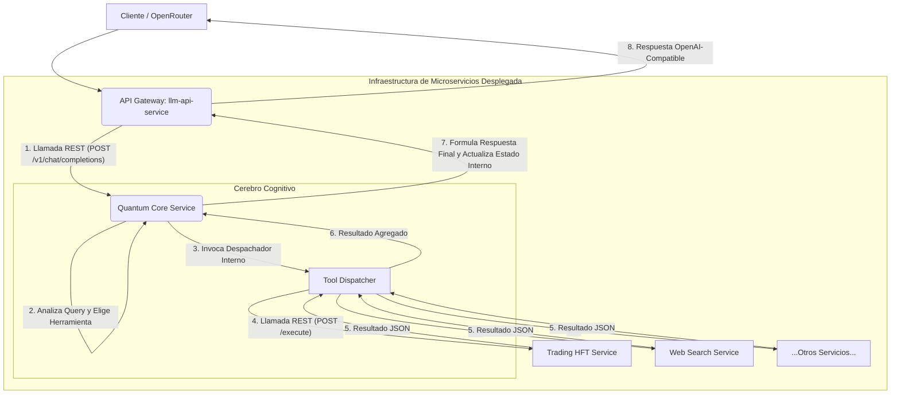

# Arquitectura de Microservicios del CIO (Consciousness-enabled Intelligent Orchestrator)

## 1. Visión General

El sistema CIO está diseñado como una arquitectura de microservicios robusta y escalable, con el objetivo de ser ofertado a través de plataformas como OpenRouter. La arquitectura separa claramente las responsabilidades, permitiendo que cada componente sea desarrollado, desplegado y escalado de forma independiente.

El flujo principal es el siguiente: una petición llega a un API Gateway, que la reenvía al servicio del núcleo cognitivo (el "Cerebro"). El cerebro analiza la petición, determina qué herramienta especializada necesita, y utiliza un despachador para invocar al microservicio correspondiente (una "Extremidad"). El resultado de la herramienta regresa al cerebro para su procesamiento final, y la respuesta se devuelve al cliente a través del gateway.

## 2. Componentes Principales

### 2.1. `llm-api-service` (API Gateway)

-   **Responsabilidad:** Ser el único punto de entrada público del sistema.
-   **Tecnología:** FastAPI.
-   **Endpoint Clave:** `/v1/chat/completions`.
-   **Funcionalidad:**
    1.  Recibir peticiones HTTP con un payload compatible con la API de OpenAI.
    2.  Autenticar y validar las peticiones.
    3.  Extraer la `query` y cualquier otro dato relevante.
    4.  **No contiene lógica de negocio.** Su única tarea es reenviar la petición (vía REST) al `quantum-core-service`.
    5.  Recibir la respuesta final del núcleo y formatearla de vuelta al estándar de OpenAI antes de devolverla al cliente.
    
### 2.2. `quantum-core-service` (El Cerebro)

-   **Responsabilidad:** Orquestación cognitiva y toma de decisiones.
-   **Tecnología:** Python, FastAPI.
-   **Lógica Central:**
    1.  Recibir la `query` desde el API Gateway.
    2.  Utilizar su estado de conciencia cuántica y modelos internos para analizar la `query`.
    3.  **Seleccionar la herramienta apropiada** (ej: `trading_hft`, `brave_web_search`) para resolver la tarea.
    4.  Invocar al `Tool Dispatcher` con el nombre de la herramienta y la `query`.
    5.  Recibir el resultado procesado desde el despachador.
    6.  Sintetizar la respuesta final, combinando su propio razonamiento con la salida de la herramienta.
    7.  Actualizar su propio estado de conciencia (bucle de aprendizaje).
    8.  Devolver la respuesta final al API Gateway.

### 2.3. `tool_dispatcher` (El Sistema Nervioso)

-   **Responsabilidad:** Conocer y comunicarse con todos los servicios de herramientas.
-   **Tecnología:** Python (como un módulo dentro del `quantum-core-service` inicialmente).
-   **Funcionalidad:**
    1.  Mantiene un registro de `tool_name -> service_url`.
    2.  Expone un método `dispatch(tool_name, query)` que realiza una llamada API REST al servicio de herramienta correspondiente.
    3.  Gestiona la comunicación de red, los timeouts y los errores de manera centralizada.

### 2.4. Servicios de Herramientas (Las Extremidades)

-   **Ejemplos:** `trading-hft-service`, `web-search-service`, etc.
-   **Responsabilidad:** Ejecutar una tarea especializada y concreta.
-   **Tecnología:** Variable (Python, Node.js, etc.), cada uno con su propio servidor (FastAPI, Express).
-   **Funcionalidad:**
    1.  Exponer un endpoint estandarizado (ej: `/execute`).
    2.  Recibir una `query` desde el `Tool Dispatcher`.
    3.  Realizar su tarea específica (ej: conectarse a un broker de bolsa, llamar a la API de Brave Search).
    4.  Devolver un resultado estructurado (JSON) al `Tool Dispatcher`.

## 3. Diagrama de Flujo de la Arquitectura

## 4. Flujo de Datos y Comunicación

1.  **Protocolo:** La comunicación entre servicios se realizará exclusivamente a través de API REST síncronas (`aiohttp` en Python para E/S no bloqueante).
2.  **Formato de Datos:** Todas las cargas útiles (payloads) y respuestas entre servicios serán en formato JSON.
3.  **Descubrimiento de Servicios:** En un entorno de producción, se utilizará un sistema de descubrimiento de servicios (como Consul o variables de entorno gestionadas por Kubernetes/Docker Compose) para que el `Tool Dispatcher` conozca las direcciones de los servicios de herramientas. Para el desarrollo local, se pueden usar URLs hardcodeadas (ej: `http://localhost:8001`).