# 🏗️ VIGOLEONROCKS System Architecture

This document provides a comprehensive overview of the VIGOLEONROCKS system architecture, focusing on the critical design principles that ensure compliance with project policies.

## 🚨 Architectural Principles (CRITICAL)

### 1. 🚫 No Traditional Randomness
**POLICY**: All randomness must be generated from system metrics and kernel entropy


### 2. 🔄 Background Process Architecture
**POLICY**: All services run in background with PID management and metrics exposure


## 📊 System Components

### Core Architecture Overview

```mermaid
graph TB
    subgraph "🌍 API Layer"
        A[REST Endpoints]
        B[Authentication]
        C[Rate Limiting]
    end
    
    subgraph "🔄 Background Processes"
        D[Main Service]
        E[Metrics Collector]
        F[Health Monitor]
    end
    
    subgraph "⚛️ Quantum Layer"
        G[Quantum Processor]
        H[MetricsBasedRNG]
        I[State Manager]
    end
    
    subgraph "🌍 Multilingual Engine"
        J[Language Detection]
        K[Translation Engine]
        L[Response Generator]
    end
    
    subgraph "📊 Observability"
        M[Prometheus Metrics]
        N[Application Logs]
        O[Health Checks]
    end
    
    subgraph "💾 Data Layer"
        P[PostgreSQL]
        Q[Redis Cache]
        R[Model Storage]
    end
    
    A --> D
    D --> G
    D --> J
    G --> H
    H --> I
    J --> K
    K --> L
    D --> M
    E --> M
    F --> O
    D --> P
    D --> Q
```



### 🔧 Component Details

#### 1. **API Layer** (`vigoleonrocks.interfaces`)
- **REST API**: Flask-based with Gunicorn (background mode)
- **Authentication**: JWT with secure token management
- **Rate Limiting**: Redis-backed per-endpoint limits
- **CORS**: Configurable cross-origin support

**Critical Endpoints**:
- `/api/status` - **MANDATORY**: System metrics
- `/api/quantum-metrics` - **MANDATORY**: Quantum system state
- `/api/vigoleonrocks` - Primary NLP processing
- `/api/health` - Health check probe

#### 2. **Background Process Manager** (`vigoleonrocks.core.process_manager`)
```python
class BackgroundProcessManager:
    """Manages background execution with PID tracking"""
    
    def start_background(self):
        # Fork to background with PID management
        # POLICY: Must run in background with metrics
        
    def expose_metrics(self):
        # CRITICAL: Expose /api/status and /api/quantum-metrics
        
    def health_monitoring(self):
        # Continuous health checks and auto-recovery
```

#### 3. **Quantum Processor** (`vigoleonrocks.core.quantum_processor`)
```python
class QuantumProcessor:
    """Quantum-enhanced NLP processing"""
    
    def __init__(self):
        # CRITICAL: Use MetricsBasedRNG, not Math.random
        self.rng = MetricsBasedRNG()
        
    def process_quantum_state(self, text: str, language: str):
        # Quantum entanglement-based processing
        # Uses metrics-based randomness for state selection
```

#### 4. **MetricsBasedRNG** (`vigoleonrocks.core.metrics_based_rng`)
```python
class MetricsBasedRNG:
    """CRITICAL: Randomness from system metrics only"""
    
    def __init__(self):
        # NO Math.random, numpy.random, or random.random
        self.entropy_sources = [
            KernelEntropySource(),
            CPUMetricsSource(),
            MemoryMetricsSource(),
            NetworkMetricsSource()
        ]
    
    def generate_seed(self) -> int:
        # Combine multiple metric sources for entropy
        
    def choice_from_metrics(self, options: list):
        # Select based on current system metrics
```

#### 5. **Multilingual Engine** (`vigoleonrocks.core.multilingual_engine`)
- **Language Detection**: Automatic detection with confidence scores
- **Translation Engine**: Context-aware translation
- **Cultural Adaptation**: Regional and cultural response customization
- **Response Generation**: Dynamic multilingual content creation

**Supported Languages**:
- Spanish (es) - Primary
- English (en) 
- Portuguese (pt)
- French (fr)
- German (de)

### 📊 Data Flow Architecture

#### Request Processing Flow


#### Background Process Lifecycle


## 🔧 Configuration Architecture

### Environment-Based Configuration
```python
# Configuration hierarchy (highest to lowest priority)
1. Environment variables (production)
2. .env file (development)
3. Default values (fallback)

# CRITICAL variables (must be set)
CRITICAL_CONFIG = {
    'QUANTUM_PROCESSOR_ENABLED': 'true',
    'METRICS_RNG_ENABLED': 'true',
    'BACKGROUND_EXECUTION': 'true', 
    'PROMETHEUS_ENABLED': 'true'
}
```

### Secret Management
```python
class SecureConfigManager:
    """Manages secrets with OS cryptographic randomness"""
    
    def generate_secrets(self):
        # Uses secrets module (NOT Math.random)
        return {
            'SECRET_KEY': secrets.token_urlsafe(32),
            'JWT_SECRET': secrets.token_urlsafe(32),
            'ENCRYPTION_KEY': secrets.token_hex(32)
        }
```

## 🚀 Deployment Architecture

### Container Architecture
```dockerfile
# Multi-stage build for optimization
FROM python:3.8-slim as base
# CRITICAL: Background execution setup
RUN mkdir -p /var/run /var/log/vigoleonrocks
COPY entrypoint.sh /entrypoint.sh
# Background process with PID management
CMD ["/entrypoint.sh", "background"]
```

### Kubernetes Deployment
```yaml
apiVersion: apps/v1
kind: Deployment
metadata:
  name: vigoleonrocks
spec:
  template:
    spec:
      containers:
      - name: vigoleonrocks
        image: vigoleonrocks:latest
        # CRITICAL: Health checks for background processes
        livenessProbe:
          httpGet:
            path: /api/status
            port: 5000
        readinessProbe:
          httpGet:
            path: /api/health
            port: 5000
        # Metrics exposure
        ports:
        - containerPort: 5000  # API
        - containerPort: 8000  # Prometheus metrics
```

### Service Mesh Integration
```yaml
apiVersion: v1
kind: Service
metadata:
  name: vigoleonrocks-service
spec:
  ports:
  - name: api
    port: 5000
    targetPort: 5000
  - name: metrics  # CRITICAL: Metrics exposure
    port: 8000
    targetPort: 8000
  selector:
    app: vigoleonrocks
```

## 📊 Monitoring Architecture

### Metrics Collection Stack


### Critical Metrics Exposed
```python
# Application Metrics
vigoleonrocks_requests_total{endpoint, method, status}
vigoleonrocks_request_duration_seconds{endpoint}
vigoleonrocks_background_process_status
vigoleonrocks_health_check_status

# Quantum Metrics  
vigoleonrocks_quantum_states_processed_total
vigoleonrocks_quantum_entanglement_level
vigoleonrocks_quantum_coherence_time_seconds
vigoleonrocks_metrics_rng_entropy_level

# Multilingual Metrics
vigoleonrocks_language_requests_total{language}
vigoleonrocks_translation_duration_seconds{source, target}
vigoleonrocks_response_generation_time_seconds
```

## 🔐 Security Architecture

### Security Layers


### Secure Randomness Architecture
```python
# CRITICAL: Security through proper randomness
class CryptographicRandomness:
    def __init__(self):
        # Uses OS cryptographic random
        self.secure_random = secrets.SystemRandom()
        # NEVER uses Math.random or random module
        
    def generate_token(self):
        return secrets.token_urlsafe(32)
        
    def generate_key(self):
        return secrets.token_hex(32)
```

## 🧪 Testing Architecture

### Test Pyramid


### Critical Policy Tests
```python
@pytest.mark.critical
def test_no_math_random_usage():
    """CRITICAL: Ensure no Math.random usage in codebase"""
    # Scans all Python files for prohibited patterns
    
@pytest.mark.critical  
def test_background_process_execution():
    """CRITICAL: Verify background process with metrics"""
    # Tests PID management and metrics exposure
    
@pytest.mark.critical
def test_metrics_endpoints_available():
    """CRITICAL: Verify /api/status and /api/quantum-metrics"""
    # Tests mandatory metrics endpoints
```

## ⚡ Performance Architecture

### Performance Requirements
- **API Response Time**: < 200ms (95th percentile)
- **Quantum Processing**: < 500ms for complex operations
- **Background Process Uptime**: 99.9%
- **Metrics Collection Overhead**: < 1ms per request
- **Memory Usage**: < 512MB per instance
- **CPU Usage**: < 70% under normal load

### Performance Monitoring
```python
class PerformanceMonitor:
    def measure_quantum_processing(self):
        # Track quantum operation performance
        
    def measure_multilingual_processing(self):
        # Track translation and response generation
        
    def measure_background_health(self):
        # Monitor background process performance
```

## 🔄 Scalability Architecture

### Horizontal Scaling


### Auto-scaling Configuration
```yaml
apiVersion: autoscaling/v2
kind: HorizontalPodAutoscaler
metadata:
  name: vigoleonrocks-hpa
spec:
  scaleTargetRef:
    apiVersion: apps/v1
    kind: Deployment
    name: vigoleonrocks
  minReplicas: 2
  maxReplicas: 10
  metrics:
  - type: Pods
    pods:
      metric:
        name: vigoleonrocks_background_process_cpu_usage
      target:
        type: AverageValue
        averageValue: "70"
```

## 📝 Key Architectural Decisions

### 1. **Background-Only Execution**
- **Decision**: All services must run in background with PID management
- **Rationale**: Enables proper monitoring, logging, and maintenance
- **Implementation**: Custom process manager with health checks

### 2. **Metrics-Based Randomness** 
- **Decision**: Prohibited traditional RNG, use system metrics
- **Rationale**: Enhanced security and deterministic debugging
- **Implementation**: MetricsBasedRNG with multiple entropy sources

### 3. **Mandatory Metrics Exposure**
- **Decision**: All services expose /api/status and /api/quantum-metrics
- **Rationale**: Critical for debugging, maintenance, and monitoring
- **Implementation**: Embedded Prometheus metrics server

### 4. **Quantum-Enhanced Processing**
- **Decision**: Use quantum principles for NLP enhancement
- **Rationale**: Advanced processing capabilities and differentiation
- **Implementation**: Custom quantum processor with entanglement simulation

### 5. **Multilingual-First Design**
- **Decision**: Native multilingual support across all components
- **Rationale**: Global applicability and cultural awareness
- **Implementation**: Embedded translation and cultural adaptation

---

**Remember**: This architecture is designed to enforce the critical project policies while providing scalable, maintainable, and high-performance quantum-enhanced multilingual NLP processing.
