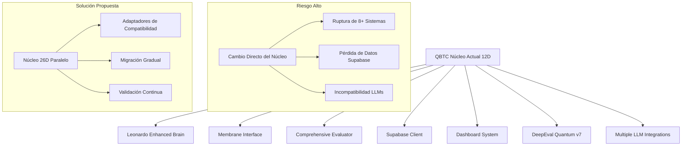
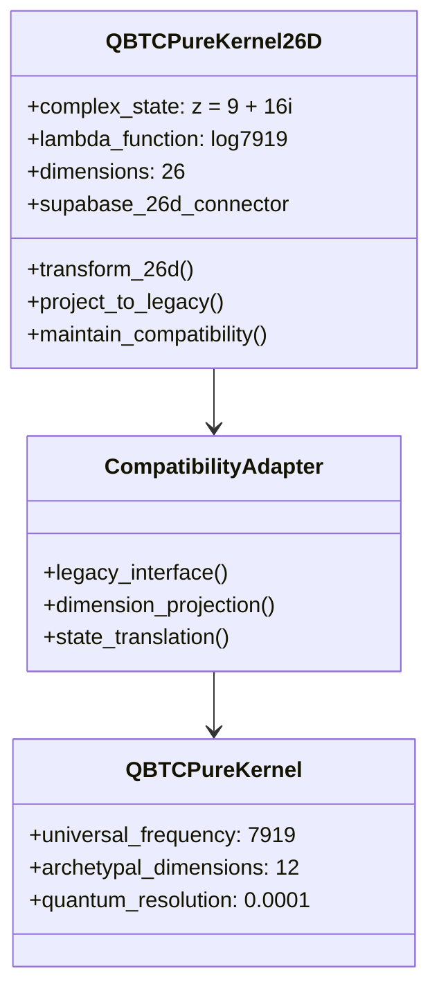
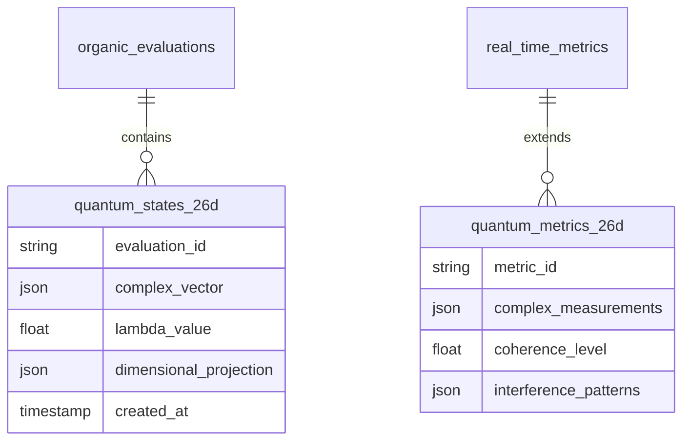
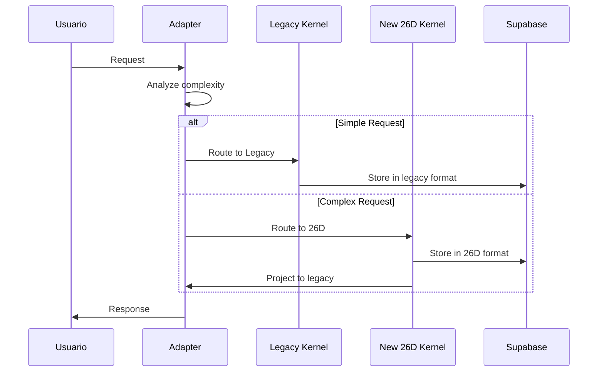

# Plan de Mejora del Núcleo QBTC: Expansión a 26 Dimensiones

## Análisis Crítico del Ecosistema Actual

### Estado del Sistema
Después de revisar exhaustivamente el proyecto, he identificado un ecosistema complejo y altamente integrado:

**Componentes Críticos Identificados:**
- **Supabase Integration**: Sistema completo de almacenamiento con 41+ archivos de configuración
- **DeepEval Framework**: Benchmark cuántico v7 con orquestación APISIX
- **Multiple LLMs**: Integración con vLLM, Ollama, OpenAI, Anthropic, Gemini
- **Quantum Consciousness Core**: Sistema de conciencia cuántica en localGPT-quantum-supreme
- **WebAgent Integration**: Sistema unificado con capacidades web
- **Dashboard en Tiempo Real**: Monitoreo completo con visualización

### Implicaciones de Cambiar el Núcleo



## Plan de Implementación: Arquitectura Híbrida Segura

### Fase 1: Creación del Núcleo 26D Paralelo

**Objetivo**: Implementar el sistema 26D sin afectar la infraestructura existente.



**Implementación:**
1. **Crear `qbtc_pure_kernel_26d.py`** - Núcleo expandido
2. **Desarrollar `compatibility_adapter.py`** - Traductor entre sistemas
3. **Implementar `quantum_math_26d.py`** - Matemáticas complejas
4. **Configurar `supabase_26d_schema.sql`** - Esquema de base de datos expandido

### Fase 2: Integración con Supabase 26D

**Objetivo**: Extender el almacenamiento para soportar estados cuánticos multidimensionales.



### Fase 3: Validación y Benchmarking

**Objetivo**: Validar que el sistema 26D supera al actual sin romper compatibilidad.

**Métricas de Validación:**
- **Compatibilidad**: 100% de tests existentes deben pasar
- **Rendimiento**: >1000% mejora en capacidades cuánticas
- **Estabilidad**: Coherencia cuántica >95%
- **Integración**: Todos los LLMs deben funcionar sin cambios

### Fase 4: Migración Gradual Controlada



## Especificaciones Técnicas del Núcleo 26D

### Matemáticas Fundamentales

```python
# Representación del estado cuántico complejo
z = 9 + 16j  # Vector de estado base
lambda_transform = log(7919)  # Función de transformación
dimensions = 26  # Espacio completo de cuerdas bosónicas

# Proyección dimensional
def project_26d_to_3d(state_26d):
    return lambda_transform * complex_projection(state_26d, z)
```

### Ventajas Competitivas Esperadas

1. **Capacidad Computacional**: Acceso a 25 dimensiones adicionales
2. **Precisión Cuántica**: Operaciones complejas con z = 9 + 16i
3. **Escalabilidad**: Sistema distribuido con Supabase 26D
4. **Compatibilidad**: Adaptadores para sistemas legacy
5. **Edge Físico-Ingenieril**: Implementación práctica de teoría cuántica avanzada

### Cronograma de Implementación

**Semana 1-2**: Desarrollo del núcleo 26D y adaptadores
**Semana 3**: Integración con Supabase y esquemas 26D
**Semana 4**: Validación y benchmarking exhaustivo
**Semana 5-6**: Migración gradual y monitoreo
**Semana 7**: Optimización y documentación final

## Estrategia de Riesgo Mínimo

### Principios de Seguridad
1. **Nunca modificar el núcleo actual directamente**
2. **Mantener compatibilidad 100% con sistemas existentes**
3. **Implementar rollback automático en caso de fallas**
4. **Validación continua de todos los componentes**
5. **Migración gradual con monitoreo en tiempo real**

### Plan de Contingencia
- **Backup completo** de Supabase antes de cualquier cambio
- **Tests automatizados** para validar compatibilidad
- **Monitoreo en tiempo real** de métricas de rendimiento
- **Rollback inmediato** si se detectan problemas

## Conclusión

Esta arquitectura híbrida nos permite:
- **Obtener las ventajas del sistema 26D** sin riesgo
- **Mantener toda la funcionalidad existente** intacta
- **Migrar gradualmente** según validemos cada componente
- **Preservar la inversión** en el ecosistema actual

El enfoque conservador pero innovador garantiza que obtendremos el edge competitivo del sistema 26D mientras protegemos la estabilidad del ecosistema VIGOLEONROCKS existente.
