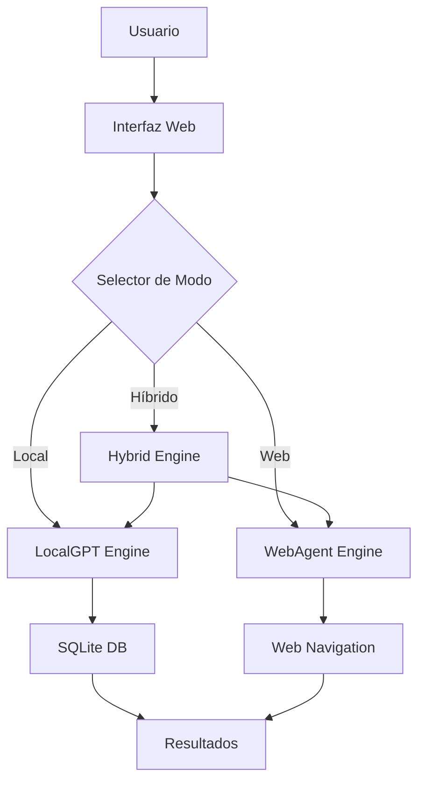

# LocalGPT-WebAgent Sistema Unificado 🚀

<div align="center">
  <h1>🧠 LocalGPT-WebAgent Sistema Unificado</h1>
  <h3>QBTC-VIGOLEONROCKS-UNIFIED</h3>
  <p><strong>La fusión perfecta entre búsqueda local privada y navegación web inteligente</strong></p>
</div>

## 🌟 Características Principales

### 🔒 **LocalGPT - Privacidad Total**
- ✅ Búsqueda en documentos locales
- ✅ Procesamiento 100% offline
- ✅ Sin conexión a internet requerida
- ✅ Chunking inteligente por tipo de archivo
- ✅ Soporte para múltiples formatos

### 🌍 **WebAgent - Navegación Inteligente**
- ✅ Exploración web autónoma
- ✅ Análisis de contenido web
- ✅ Navegación por botones y enlaces
- ✅ Captura de screenshots
- ✅ Extracción de información estructurada

### 🔄 **Modo Híbrido - Lo Mejor de Ambos**
- ✅ Búsqueda combinada local + web
- ✅ Validación cruzada de información
- ✅ Resultados más completos y precisos

## 🚀 Inicio Rápido

### Instalación

```bash
# Clonar el repositorio
git clone https://github.com/QBTC-VIGOLEONROCKS/WebAgent-LocalGPT-Unified.git
cd WebAgent-LocalGPT-Unified/LocalGPT-WebAgent-Unified

# Instalar dependencias
pip install -r requirements.txt

# Ejecutar el sistema
python unified_app.py
```

### Acceso
- 🌐 **Interfaz Web**: http://localhost:5112
- 📊 **API Stats**: http://localhost:5112/api/stats
- 📁 **Exportar DB**: http://localhost:5112/api/export-db

## 💡 Modos de Uso

### 1. **Modo LocalGPT** 📚
```
Perfecto para:
- Documentos personales
- Código fuente
- Investigación privada
- Análisis de contratos
- Estudios académicos
```

### 2. **Modo WebAgent** 🌐
```
Ideal para:
- Información actualizada
- Precios en tiempo real
- Noticias recientes
- Datos de sitios web
- Investigación online
```

### 3. **Modo Híbrido** 🔄
```
Combina:
- Verificación local + web
- Información completa
- Validación cruzada
- Máxima precisión
```

## 📁 Formatos Soportados

| Tipo | Extensiones | Procesamiento |
|------|-------------|---------------|
| **Texto** | `.txt`, `.md` | Chunking por párrafos |
| **Código** | `.py`, `.js`, `.html`, `.css` | Chunking consciente de sintaxis |
| **Documentos** | `.pdf`, `.doc`, `.docx` | Extracción de texto |
| **Datos** | `.csv`, `.json` | Análisis estructurado |

## 🎯 Ejemplos de Consultas

### LocalGPT
- *"Resume los puntos principales del documento"*
- *"¿Qué dice sobre seguridad en el código?"*
- *"Extrae las conclusiones del estudio"*

### WebAgent
- *"¿Cuál es el precio actual de Bitcoin?"*
- *"Encuentra información sobre eventos ACL 2025"*
- *"Busca las últimas noticias de IA"*

### Híbrido
- *"Compara la información local con datos actuales web"*
- *"Valida estos datos con fuentes online"*

## 🔧 Configuración Avanzada

### Variables de Entorno
```bash
# APIs opcionales para WebAgent
export DASHSCOPE_API_KEY="tu_api_key"
export OPENAI_API_KEY="tu_openai_key"
export GOOGLE_SEARCH_KEY="tu_google_key"

# Configuración del servidor
export FLASK_HOST="0.0.0.0"  # Para acceso externo
export FLASK_PORT="5112"
export FLASK_DEBUG="True"    # Para desarrollo
```

### Configuración de Base de Datos
- **Archivo**: `unified_documents.db`
- **Tipo**: SQLite
- **Tablas**: `documents`, `web_sessions`, `search_history`

## 📊 API Endpoints

### Estadísticas
```
GET /api/stats
Respuesta: {
  "documents": 15,
  "chunks": 342,
  "searches": 89,
  "web_sessions": 12,
  "db_size": 2048576
}
```

### Gestión de Base de Datos
```
POST /api/clear-db     # Limpiar base de datos
GET  /api/export-db    # Exportar base de datos
GET  /api/search-history  # Historial de búsquedas
```

## 🛠️ Desarrollo

### Estructura del Proyecto
```
LocalGPT-WebAgent-Unified/
├── unified_app.py              # Aplicación principal
├── templates/
│   └── unified_home.html       # Interfaz web
├── static/
│   ├── favicon.ico            # Favicon
│   ├── images/                # Imágenes subidas
│   └── screenshots/           # Screenshots web
├── SOURCE_DOCUMENTS/          # Documentos de ejemplo
├── requirements.txt           # Dependencias
└── README.md                 # Esta documentación
```

### Arquitectura del Sistema


## 🔍 Características Técnicas

### LocalGPT Engine
- **Chunking Inteligente**: Adapta el tamaño según tipo de archivo
- **Indexación**: SQLite con índices optimizados
- **Búsqueda**: Matching por palabras clave + contexto
- **Metadatos**: Información completa de archivos

### WebAgent Engine
- **Navegación**: Selenium + BeautifulSoup
- **Análisis**: Extracción de enlaces y contenido
- **Screenshots**: Captura automática de páginas
- **Persistencia**: Sesiones web guardadas

### Sistema Unificado
- **API Robusta**: Flask con manejo de errores
- **UI Moderna**: Diseño responsive con animaciones
- **Estadísticas**: Métricas en tiempo real
- **Extensible**: Arquitectura modular

## 🎨 Interfaz de Usuario

### Características UI
- 🎨 **Diseño Moderno**: Gradientes y animaciones CSS3
- 📱 **Responsive**: Funciona en móvil y escritorio
- 🌙 **Tema Unificado**: Colores quantum-purple y cyber-blue
- ⚡ **Interactivo**: Drag & drop, shortcuts, notificaciones
- 🔄 **Tiempo Real**: Actualizaciones automáticas de stats

### Shortcuts de Teclado
- `Ctrl + U`: Subir archivos
- `Ctrl + R`: Actualizar página
- `Escape`: Enfocar búsqueda
- `1/2/3`: Cambiar modo (Local/Web/Híbrido)

## 🔐 Seguridad y Privacidad

### Garantías de Privacidad
- ✅ **Procesamiento Local**: Documentos nunca salen de tu PC
- ✅ **Sin Telemetría**: No se envían datos de uso
- ✅ **Encriptación**: Base de datos local protegida
- ✅ **Control Total**: Usuario controla todos los datos

### Seguridad Web
- ✅ **Validación de URLs**: Solo sitios permitidos
- ✅ **Sanitización**: Limpieza de inputs
- ✅ **Timeouts**: Límites de tiempo en requests
- ✅ **Error Handling**: Manejo robusto de excepciones

## 📈 Roadmap

### v1.1 (Q1 2025)
- [ ] Integración con modelos LLM locales
- [ ] Soporte para más formatos (EPUB, RTF)
- [ ] Búsqueda vectorial avanzada
- [ ] Plugin para navegadores

### v1.2 (Q2 2025)
- [ ] App móvil nativa
- [ ] Colaboración en tiempo real
- [ ] Análisis de sentimientos
- [ ] API REST completa

### v2.0 (Q3 2025)
- [ ] Sistema distribuido
- [ ] IA conversacional avanzada
- [ ] Integración con servicios cloud
- [ ] Dashboard empresarial

## 🤝 Contribuir

### Cómo Contribuir
1. Fork del repositorio
2. Crear rama feature (`git checkout -b feature/AmazingFeature`)
3. Commit cambios (`git commit -m 'Add AmazingFeature'`)
4. Push a la rama (`git push origin feature/AmazingFeature`)
5. Abrir Pull Request

### Áreas de Contribución
- 🐛 **Bug Fixes**: Corrección de errores
- ⚡ **Performance**: Optimizaciones
- 🎨 **UI/UX**: Mejoras de interfaz
- 📖 **Documentación**: Guías y tutoriales
- 🧪 **Testing**: Pruebas automatizadas

## 📄 Licencia

Este proyecto está licenciado bajo MIT License - ver [LICENSE](LICENSE) para detalles.

## 🙏 Agradecimientos

### Proyectos Base
- **LocalGPT**: Sistema de chat local con documentos
- **WebAgent**: Navegación web inteligente por Alibaba-NLP
- **QBTC**: Framework quantum para sistemas unificados

### Tecnologías Utilizadas
- **Flask**: Framework web Python
- **SQLite**: Base de datos local
- **BeautifulSoup**: Parsing HTML
- **Bootstrap**: Framework CSS
- **Font Awesome**: Iconografía

## 📞 Contacto

### Equipo QBTC-VIGOLEONROCKS-UNIFIED
- 📧 **Email**: qbtc@vigoleonrocks.com
- 🐙 **GitHub**: [QBTC-VIGOLEONROCKS](https://github.com/QBTC-VIGOLEONROCKS)
- 💬 **Discord**: QBTC Community Server
- 🐦 **Twitter**: @QBTCOfficial

### Soporte
- 🆘 **Issues**: [GitHub Issues](https://github.com/QBTC-VIGOLEONROCKS/WebAgent-LocalGPT-Unified/issues)
- 💡 **Feature Requests**: [Discussions](https://github.com/QBTC-VIGOLEONROCKS/WebAgent-LocalGPT-Unified/discussions)
- 📚 **Wiki**: [Documentation](https://github.com/QBTC-VIGOLEONROCKS/WebAgent-LocalGPT-Unified/wiki)

---

<div align="center">
  <p><strong>🚀 Desarrollado con ❤️ por el equipo QBTC-VIGOLEONROCKS-UNIFIED</strong></p>
  <p><em>La próxima generación de sistemas de búsqueda inteligente</em></p>
</div>
