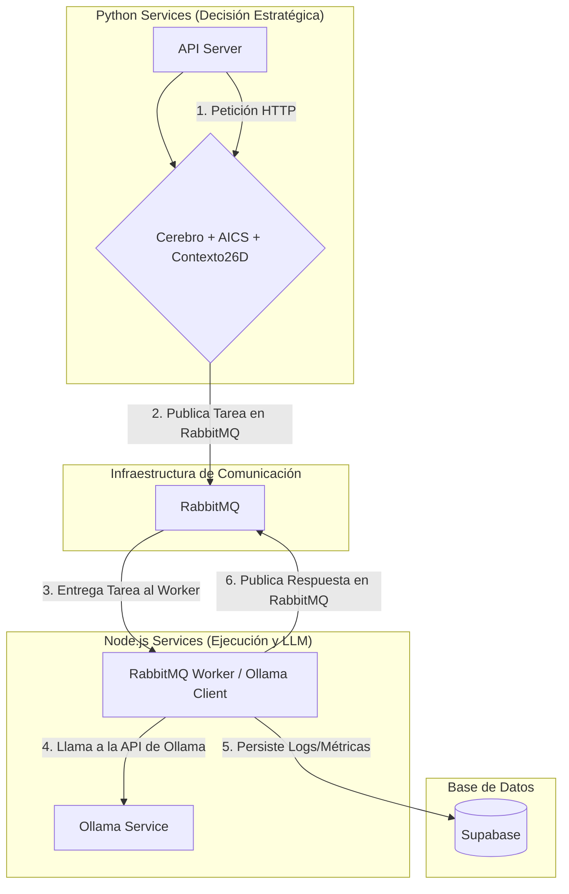

# Sistema QBTC Unificado - Arquitectura y Plan de Implementación

## 1. Resumen

Este documento describe la arquitectura y el plan de implementación para el sistema **QBTC Unificado**. El objetivo es construir un sistema de inteligencia artificial avanzado, basado en una arquitectura de microservicios híbrida (Python y Node.js), que utiliza un modelo de lenguaje local (Ollama) y un bus de mensajería asíncrona (RabbitMQ) para la orquestación de tareas.

## 2. Arquitectura Final

El sistema está compuesto por servicios de decisión escritos en Python y servicios de ejecución escritos en Node.js, comunicados a través de RabbitMQ.

### Componentes Principales

*   **API Server (Python/FastAPI):** El punto de entrada unificado para todas las peticiones externas.
*   **Cerebro (Python):** El núcleo lógico (`QBTCQuantumBrainLeonardo`) que orquesta el flujo de una consulta. Utiliza AICS para la decisión y el Contexto 26D para la memoria.
*   **AICS (Python):** El motor de decisión (`ExponentialLambdaOptimizationCIO`). Analiza la consulta y determina el perfil de Ollama y los parámetros de inferencia óptimos para la tarea.
*   **Contexto 26D (Python):** Un modelo de estado sofisticado (`QuantumContext26D`) que actúa como la memoria de trabajo del cerebro.
*   **RabbitMQ Worker (Node.js):** Un servicio que consume tareas de RabbitMQ, interactúa con el servicio de Ollama y publica los resultados.
*   **Ollama Service:** Una instancia de Ollama que sirve modelos (`Modelfiles`) personalizados, como `vigoleonrocks-ultra`.
*   **Supabase:** La base de datos PostgreSQL elegida para la persistencia de datos y métricas.

## 3. Plan de Implementación en 4 Fases

### Fase 1: Refactorización y Consolidación del Código Python
*   **Objetivo:** Modificar los componentes de Python para que se alineen con la nueva arquitectura y moverlos a la estructura de directorios de `qbtc-unified-system`.
*   **Acciones:**
    1.  **Refactorizar AICS:** Modificar `advanced_ionic_charge_system.py` para que seleccione perfiles de Ollama y parámetros de inferencia en lugar de modelos externos.
    2.  **Refactorizar el Cerebro:** Modificar `cio_unified_brain.py` para que integre `QuantumContext26D` como su sistema de memoria y utilice AICS para obtener la configuración de la llamada a Ollama.
    3.  **Consolidar:** Mover todos los ficheros de Python (`cio_api_server.py`, `cio_unified_brain.py`, `quantum_context_26d` y sus dependencias, `advanced_ionic_charge_system.py`) a sus respectivos directorios de servicio dentro de `qbtc-unified-system`.

### Fase 2: Implementación del Puente de Comunicación (Python -> Node.js)
*   **Objetivo:** Reemplazar la ejecución simulada por una comunicación real a través de RabbitMQ.
*   **Acciones:**
    1.  **Publicador (Python):** El Cerebro construirá un mensaje JSON con el formato esperado (`{prompt, sessionId, options}`) y lo publicará en la cola `vigoleonrocks_requests` de RabbitMQ.
    2.  **Consumidor (Node.js):** Se adaptará `vigoleonrocks-rabbitmq-service.js` para que utilice dinámicamente el perfil y los parámetros de Ollama recibidos en el mensaje.

### Fase 3: Orquestación del Ecosistema Completo con Docker
*   **Objetivo:** Hacer que todo el sistema sea fácilmente desplegable y ejecutable.
*   **Acciones:**
    1.  **Crear `Dockerfile`s:** Generar un `Dockerfile` para cada servicio personalizado (Python y Node.js).
    2.  **Crear `docker-compose.yml`:** Crear un fichero de Docker Compose que defina y conecte todos los servicios: los servicios de Python, el worker de Node.js, Ollama, RabbitMQ y Supabase.

### Fase 4: Configuración y Documentación Final
*   **Objetivo:** Facilitar la puesta en marcha del sistema.
*   **Acciones:**
    1.  **Crear script de setup:** Crear un script que, por ejemplo, construya los modelos de Ollama necesarios a partir de los `Modelfile`s.
    2.  **Actualizar este `README.md`:** Añadir una sección de "Uso" con instrucciones precisas sobre cómo levantar todo el sistema con `docker-compose up`.
